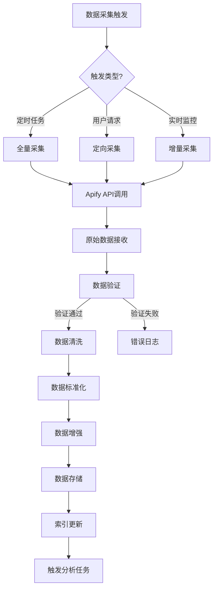

# TikTok创作者分析平台 - 数据模型设计方案

## 一、数据库Schema设计 (Prisma模型)

### 1. 核心枚举类型

```prisma
// prisma/schema.prisma

enum ContentCategory {
  ENTERTAINMENT    // 娱乐
  EDUCATION        // 教育/知识
  LIFESTYLE        // 生活方式
  BEAUTY           // 美妆
  FASHION          // 时尚
  FOOD             // 美食
  TRAVEL           // 旅行
  FITNESS          // 健身
  GAMING           // 游戏
  TECH             // 科技
  BUSINESS         // 商业
  MUSIC            // 音乐
  PETS             // 宠物
  DIY              // 手工/DIY
  OTHER
}

enum TrendStatus {
  EARLY_STAGE      // 萌芽期
  GROWING          // 成长期
  PEAK             // 高峰期
  DECLINING        // 衰退期
  EXPIRED          // 过期
}

enum VideoPotentialTier {
  VIRAL            // 爆款 (>90分)
  HIGH             // 高潜力 (70-90分)
  MEDIUM           // 中等 (40-70分)
  LOW              // 低潜力 (<40分)
}

enum DataSource {
  APIFY_SCRAPER    // Apify爬虫
  OFFICIAL_API     // TikTok官方API
  MANUAL_IMPORT    // 手动导入
  USER_UPLOAD      // 用户上传
}
```

### 2. 用户与账号模型

```prisma
// 平台用户（创作者/分析师）
model User {
  id                  String    @id @default(cuid())
  email               String    @unique
  name                String?
  avatar              String?
  
  // 关联的TikTok账号
  tiktokAccounts      TikTokAccount[]
  
  // 收藏的竞品账号
  monitoredAccounts   MonitoredAccount[]
  
  // 自定义标签体系
  customTags          Tag[]
  
  // 用户配置
  settings            UserSettings?
  
  createdAt           DateTime  @default(now())
  updatedAt           DateTime  @updatedAt
}

// TikTok账号详情
model TikTokAccount {
  id                  String    @id @default(cuid())
  
  // 基础信息
  uniqueId            String    @unique  // TikTok唯一ID (@username)
  nickname            String             // 昵称
  avatar              String             // 头像URL
  signature           String?            // 个性签名
  verified            Boolean   @default(false)
  
  // 统计数字（实时）
  followerCount       Int       @default(0)
  followingCount      Int       @default(0)
  videoCount          Int       @default(0)
  likeCount           BigInt    @default(0)
  
  // 分类与标签
  category            ContentCategory?
  customTags          Tag[]
  
  // 数据追踪
  historicalStats     AccountHistory[]
  videos              Video[]
  
  // 关联
  userId              String
  user                User      @relation(fields: [userId], references: [id], onDelete: Cascade)
  
  // 数据源与状态
  dataSource          DataSource @default(APIFY_SCRAPER)
  isActive            Boolean   @default(true)
  lastScrapedAt       DateTime?
  
  createdAt           DateTime  @default(now())
  updatedAt           DateTime  @updatedAt
  
  @@index([userId])
  @@index([uniqueId])
  @@index([category])
}

// 监控的竞品账号
model MonitoredAccount {
  id                  String    @id @default(cuid())
  
  // 竞品账号信息（缓存）
  uniqueId            String
  nickname            String
  avatar              String?
  followerCount       Int
  category            ContentCategory?
  
  // 关系定义
  relationType        String    // RIVAL(直接竞品), INSPIRATION(灵感来源), NICHE(同领域)
  notes               String?
  
  // 数据追踪
  historicalStats     AccountHistory[]
  
  // 关联
  userId              String
  user                User      @relation(fields: [userId], references: [id], onDelete: Cascade)
  
  // 对比分析数据
  comparisonMetrics   ComparisonMetric[]
  
  createdAt           DateTime  @default(now())
  updatedAt           DateTime  @updatedAt
  
  @@unique([userId, uniqueId])
}

// 账号历史数据（时间序列）
model AccountHistory {
  id                  String    @id @default(cuid())
  
  // 时间戳（按天存储）
  date                DateTime
  
  // 核心指标
  followerCount       Int
  followingCount      Int
  videoCount          Int
  likeCount           BigInt
  
  // 计算指标
  engagementRate      Float?    // 互动率
  avgViewsPerVideo    Float?    // 平均播放量
  followerGrowth      Int       // 当日涨粉
  
  // 关联
  accountId           String?
  account             TikTokAccount? @relation(fields: [accountId], references: [id], onDelete: Cascade)
  
  monitoredAccountId  String?
  monitoredAccount    MonitoredAccount? @relation(fields: [monitoredAccountId], references: [id], onDelete: Cascade)
  
  // 确保每天每个账号只有一条记录
  @@unique([accountId, date])
  @@unique([monitoredAccountId, date])
  @@index([date])
}
```

### 3. 视频数据模型

```prisma
// 视频详情
model Video {
  id                  String    @id @default(cuid())
  
  // TikTok原生ID
  videoId             String    @unique  // TikTok视频ID
  
  // 基础信息
  description         String    @db.Text
  thumbnail           String    // 封面图URL
  videoUrl            String?   // 视频URL
  duration            Int       // 时长（秒）
  
  // 发布时间
  postedAt            DateTime
  
  // 统计数字（实时更新）
  playCount           BigInt    @default(0)
  likeCount           Int       @default(0)
  commentCount        Int       @default(0)
  shareCount          Int       @default(0)
  
  // 深度指标（需要额外采集）
  completionRate      Float?    // 完播率 (0-1)
  avgWatchTime        Float?    // 平均观看时长
  uniqueViewers       Int?      // 独立观众数
  
  // 内容分析
  hashtags            Hashtag[] // 标签
  mentions            Mention[] // 提及用户
  music               Music?    @relation(fields: [musicId], references: [id])
  musicId             String?
  
  // 分类与标签
  category            ContentCategory?
  customTags          Tag[]
  
  // 内容特征（AI分析）
  contentFeatures     Json?     // { hasText: boolean, hasVoice: boolean, effectTypes: [], ... }
  transcript          String?   // 字幕/转录文本
  
  // 关联
  accountId           String
  account             TikTokAccount @relation(fields: [accountId], references: [id], onDelete: Cascade)
  
  // 历史数据
  historicalStats     VideoHistory[]
  
  // 潜力分析
  potentialScore      VideoPotential?
  
  // 趋势关联
  trendParticipations TrendParticipation[]
  
  // 数据源
  dataSource          DataSource @default(APIFY_SCRAPER)
  
  createdAt           DateTime  @default(now())
  updatedAt           DateTime  @updatedAt
  
  @@index([accountId])
  @@index([postedAt])
  @@index([category])
  @@index([playCount])
}

// 视频历史数据（小时级追踪）
model VideoHistory {
  id                  String    @id @default(cuid())
  
  // 时间戳（按小时存储）
  timestamp           DateTime
  
  // 核心指标
  playCount           BigInt
  likeCount           Int
  commentCount        Int
  shareCount          Int
  
  // 增长速度（与上一小时对比）
  playGrowth          BigInt    // 播放增长
  likeGrowth          Int       // 点赞增长
  commentGrowth       Int       // 评论增长
  shareGrowth         Int       // 分享增长
  
  // 计算指标
  engagementRate      Float     // 互动率
  viralityScore       Float?    // 传播分数
  
  // 关联
  videoId             String
  video               Video     @relation(fields: [videoId], references: [id], onDelete: Cascade)
  
  @@unique([videoId, timestamp])
  @@index([timestamp])
  @@index([videoId, timestamp])
}

// 视频潜力评分
model VideoPotential {
  id                  String    @id @default(cuid())
  
  // 总分与分级
  score               Float     // 0-100
  tier                VideoPotentialTier
  confidence          Float     // 置信度 (0-1)
  
  // 子分数
  growthVelocity      Float     // 增长速度分 (0-25)
  engagementQuality   Float     // 互动质量分 (0-25)
  timingScore         Float     // 时机分 (0-25)
  contentScore        Float     // 内容分 (0-25)
  
  // 预测数据
  predictedPeakViews  BigInt?   // 预测峰值播放量
  predictedPeakTime   DateTime? // 预测达到峰值时间
  
  // 分析详情
  analysisDetails     Json      // { signals: [...], factors: {...} }
  
  // 关联
  videoId             String    @unique
  video               Video     @relation(fields: [videoId], references: [id], onDelete: Cascade)
  
  // 更新时间
  calculatedAt        DateTime  @default(now())
  
  @@index([score])
  @@index([tier])
}

// 音乐/音效
model Music {
  id                  String    @id @default(cuid())
  
  // TikTok音乐ID
  musicId             String    @unique
  
  // 音乐信息
  title               String
  author              String?
  thumbnail           String?
  duration            Int
  
  // 使用统计
  useCount            BigInt    @default(0)
  
  // 趋势状态
  isTrending          Boolean   @default(false)
  trendScore          Float?
  
  // 关联
  videos              Video[]
  
  createdAt           DateTime  @default(now())
  updatedAt           DateTime  @updatedAt
}

// 话题标签
model Hashtag {
  id                  String    @id @default(cuid())
  
  name                String    @unique
  
  // 统计
  videoCount          BigInt    @default(0)
  viewCount           BigInt    @default(0)
  
  // 趋势关联
  trendId             String?
  trend               Trend?    @relation(fields: [trendId], references: [id])
  
  // 关联
  videos              Video[]
  
  createdAt           DateTime  @default(now())
  updatedAt           DateTime  @updatedAt
}

// 提及用户
model Mention {
  id                  String    @id @default(cuid())
  uniqueId            String    // 被提及的用户ID
  nickname            String?
  
  videos              Video[]
}
```

### 4. 趋势数据模型

```prisma
// 趋势定义
model Trend {
  id                  String    @id @default(cuid())
  
  // 趋势名称与描述
  name                String    // e.g., "#summer2024", "dance challenge name"
  description         String?
  
  // 趋势类型
  type                String    // HASHTAG, MUSIC, CHALLENGE, EFFECT, SOUND, TOPIC
  
  // 关联标签/音乐
  hashtags            Hashtag[]
  musicId             String?
  
  // 生命周期状态
  status              TrendStatus
  
  // 时间范围
  startedAt           DateTime
  peakedAt            DateTime?
  endedAt             DateTime?
  
  // 统计指标
  totalVideos         BigInt    @default(0)
  totalViews          BigInt    @default(0)
  
  // 趋势指标
  velocity            Float     // 上升速度
  saturation          Float     // 饱和度 (0-1)
  momentumScore       Float     // 动量分数
  
  // 预测
  predictedPeakDate   DateTime?
  predictionConfidence Float
  
  // 历史数据
  historicalData      TrendHistory[]
  
  // 参与记录
  participations      TrendParticipation[]
  
  // 分类
  category            ContentCategory?
  
  createdAt           DateTime  @default(now())
  updatedAt           DateTime  @updatedAt
  
  @@index([status])
  @@index([type])
  @@index([category])
  @@index([momentumScore])
}

// 趋势历史数据
model TrendHistory {
  id                  String    @id @default(cuid())
  
  trendId             String
  trend               Trend     @relation(fields: [trendId], references: [id], onDelete: Cascade)
  
  // 时间点
  timestamp           DateTime
  
  // 指标
  videoCount          BigInt
  viewCount           BigInt
  participantCount    Int       // 参与创作者数
  
  // 变化率
  videoGrowthRate     Float     // 视频增长率
  viewGrowthRate      Float     // 播放量增长率
  
  // 竞争度
  avgViewsPerVideo    Float     // 平均播放量
  topCreatorShare     Float     // 头部创作者占比
  
  @@unique([trendId, timestamp])
  @@index([timestamp])
}

// 趋势参与记录
model TrendParticipation {
  id                  String    @id @default(cuid())
  
  trendId             String
  trend               Trend     @relation(fields: [trendId], references: [id], onDelete: Cascade)
  
  videoId             String
  video               Video     @relation(fields: [videoId], references: [id], onDelete: Cascade)
  
  // 参与表现
  performanceRank     Int?      // 在该趋势下的排名
  viewShare           Float?    // 播放量占比
  
  // 时机
  participatedAt      DateTime  // 参与时间
  isEarlyAdopter      Boolean   @default(false) // 是否为早期参与者
  
  createdAt           DateTime  @default(now())
  
  @@unique([trendId, videoId])
}
```

### 5. 竞品分析模型

```prisma
// 竞品对比指标
model ComparisonMetric {
  id                  String    @id @default(cuid())
  
  // 关联
  userId              String
  user                User      @relation(fields: [userId], references: [id], onDelete: Cascade)
  
  monitoredAccountId  String
  monitoredAccount    MonitoredAccount @relation(fields: [monitoredAccountId], references: [id], onDelete: Cascade)
  
  // 对比时间范围
  periodStart           DateTime
  periodEnd             DateTime
  
  // 对比维度
  // 1. 粉丝规模
  myFollowerCount       Int
  rivalFollowerCount    Int
  followerGap           Int       // 粉丝差距
  followerGapRatio      Float     // 粉丝差距比例
  
  // 2. 内容产出
  myVideoCount          Int
  rivalVideoCount       Int
  myAvgPostFreq         Float     // 我的平均发布频率
  rivalAvgPostFreq      Float     // 竞品平均发布频率
  
  // 3. 互动表现
  myEngagementRate      Float
  rivalEngagementRate   Float
  engagementDiff        Float     // 互动率差异
  
  // 4. 播放表现
  myAvgViews            Float
  rivalAvgViews         Float
  viewEfficiency        Float     // 播放效率比
  
  // 5. 成长速度
  myGrowthRate          Float     // 我的增长率
  rivalGrowthRate       Float     // 竞品增长率
  
  // 追赶难度评估
  catchUpDifficulty     Float     // 0-100，越高越难追赶
  estimatedCatchUpDays  Int?      // 预计追赶天数
  
  // 分析摘要
  strengths             Json      // ["engagement", "content_quality", ...]
  weaknesses            Json      // ["posting_frequency", "timing", ...]
  
  // 机会点
  opportunities         Json?     // 分析发现的机会
  
  createdAt             DateTime  @default(now())
  
  @@index([userId, monitoredAccountId])
  @@index([periodEnd])
}

// 竞品内容分析
model RivalContentAnalysis {
  id                  String    @id @default(cuid())
  
  monitoredAccountId  String
  
  // 分析时间段
  periodStart           DateTime
  periodEnd             DateTime
  
  // 内容主题分析
  topThemes             Json      // [{theme: "教程", count: 15, avgViews: 10000}, ...]
  topHashtags           Json      // 高频标签
  
  // 发布策略
  bestPostTimes         Json      // [{hour: 19, avgViews: 15000}, ...]
  optimalVideoLength    Int?      // 最佳视频时长
  
  // 爆款分析
  viralVideos           Json      // 爆款视频特征
  viralPatterns         Json      // 爆款模式
  
  createdAt             DateTime  @default(now())
}
```

### 6. 辅助模型

```prisma
// 自定义标签
model Tag {
  id                  String    @id @default(cuid())
  name                String
  color               String?   // 标签颜色
  
  // 关联
  userId              String
  user                User      @relation(fields: [userId], references: [id], onDelete: Cascade)
  
  videos              Video[]
  accounts            TikTokAccount[]
  
  @@unique([userId, name])
}

// 用户设置
model UserSettings {
  id                  String    @id @default(cuid())
  
  userId              String    @unique
  user                User      @relation(fields: [userId], references: [id], onDelete: Cascade)
  
  // 通知设置
  notifyViralThreshold   Float    @default(80)  // 潜力分超过此值通知
  notifyTrending         Boolean @default(true)
  
  // 数据刷新频率
  dataRefreshInterval    String   @default("1h") // 1h, 6h, 12h, 24h
  
  // 看板自定义
  dashboardLayout        Json?    // 看板布局配置
  
  // 隐私设置
  isPublic               Boolean  @default(false) // 数据是否公开
}

// 系统任务队列
model ScrapeTask {
  id                  String    @id @default(cuid())
  
  taskType            String    // ACCOUNT_UPDATE, VIDEO_UPDATE, TREND_SCAN
  status              String    // PENDING, RUNNING, COMPLETED, FAILED
  
  targetId            String    // 目标ID
  targetType          String    // ACCOUNT, VIDEO, HASHTAG
  
  priority            Int       @default(0)
  
  // 执行记录
  startedAt           DateTime?
  completedAt         DateTime?
  errorMessage        String?
  
  // 结果统计
  itemsProcessed      Int       @default(0)
  
  createdAt           DateTime  @default(now())
  
  @@index([status, priority])
  @@index([targetType, targetId])
}
```

---

## 二、核心指标计算公式

### 1. 视频指标公式

#### 基础互动率
```
ER_basic = (likes + comments + shares) / plays × 100%
```

#### 加权互动率（考虑互动质量）
```
ER_weighted = (likes + 2×comments + 3×shares) / plays × 100%
```

#### 完播率
```
CR = avg_watch_time / duration × 100%
```

#### 涨粉效率（单视频）
```
FPE = new_followers_gained / plays × 10000‰
```

### 2. 潜力视频识别算法

#### 增长速度分 (0-25分)
```
V_growth = min(25, growth_velocity_score)

growth_velocity_score = (
  play_growth_per_hour / baseline_play × 15 +     // 播放量增速权重
  like_growth_per_hour / baseline_likes × 5 +     // 点赞增速权重
  share_growth_per_hour / baseline_shares × 5     // 分享增速权重
)

// 基准值根据账号历史表现计算
baseline = avg(last_10_videos.performance)
```

#### 互动质量分 (0-25分)
```
V_engagement = min(25, engagement_score)

engagement_score = (
  ER_weighted / account_avg_ER × 10 +              // 与账号平均水平对比
  completion_rate × 10 +                          // 完播率
  (avg_watch_time / duration) × 5                 // 观看深度
)
```

#### 时机分 (0-25分)
```
V_timing = min(25, timing_score)

timing_score = (
  optimal_post_time_match × 8 +                   // 是否在最佳发布时间
  trend_alignment × 10 +                          // 是否契合当前趋势
  seasonal_relevance × 7                          // 季节/节日相关性
)

// 趋势契合度计算
trend_alignment = Σ(hashtag_match × trend_velocity) / Σ(trend_velocity)
```

#### 内容分 (0-25分)
```
V_content = min(25, content_score)

content_score = (
  viral_pattern_match × 10 +                      // 是否符合爆款模式
  content_freshness × 8 +                         // 内容新颖度
  quality_score × 7                               // 制作质量（分辨率、音频等）
)
```

#### 综合潜力分
```
P_total = V_growth + V_engagement + V_timing + V_content

// 置信度（基于数据完整度）
confidence = (
  has_completion_data × 0.3 +
  has_hourly_data × 0.3 +
  data_points_count / expected_points × 0.4
)
```

### 3. 账号价值评估算法

#### 粉丝价值分 (0-25分)
```
A_followers = min(25, follower_score)

follower_score = (
  log10(follower_count) / log10(10^7) × 15 +      // 粉丝规模
  follower_growth_rate × 5 +                      // 增长速度
  follower_retention × 5                           // 留存率（取关率低）
)
```

#### 内容产出分 (0-25分)
```
A_content = min(25, content_score)

content_score = (
  posting_consistency × 10 +                      // 发布规律性
  content_diversity × 8 +                         // 内容多样性
  avg_production_quality × 7                       // 平均制作质量
)
```

#### 互动健康分 (0-25分)
```
A_engagement = min(25, engagement_health_score)

engagement_health_score = (
  avg_ER / category_avg_ER × 10 +                 // 互动率 vs 行业平均
  engagement_consistency × 10 +                   // 互动稳定性（方差小）
  comment_sentiment × 5                            // 评论情感正向度
)
```

#### 变现潜力分 (0-25分)
```
A_monetization = min(25, monetization_score)

monetization_score = (
  niche_commercial_value × 10 +                   // 领域商业价值
  audience_purchasing_power × 8 +                 // 受众购买力
  brand_appeal × 7                               // 品牌吸引力
)

// 领域商业价值参考
niche_value = {
  BEAUTY: 1.0, FASHION: 0.95, TECH: 0.9,
  FITNESS: 0.85, FOOD: 0.8, TRAVEL: 0.75,
  ENTERTAINMENT: 0.6, GAMING: 0.7, ...
}
```

#### 综合账号价值
```
V_account = A_followers + A_content + A_engagement + A_monetization

// 账号等级划分
Tier S: 90-100 (头部创作者)
Tier A: 75-89 (优质创作者)
Tier B: 60-74 (成长型创作者)
Tier C: 40-59 (新手创作者)
Tier D: <40 (需优化)
```

### 4. 趋势指标公式

#### 趋势上升速度
```
velocity = (current_view_count - view_count_24h_ago) / view_count_24h_ago × 100

// 标准化为0-100
velocity_normalized = min(100, velocity / max_velocity_in_category × 100)
```

#### 趋势饱和度
```
saturation = (
  top_10_creator_view_share × 0.4 +              // 头部集中度
  avg_views_decline_rate × 0.3 +                 // 平均播放量下降
  new_participant_ratio × 0.3                     // 新参与者比例（低则饱和）
)
```

#### 趋势动量分
```
momentum = velocity × (1 - saturation) × trend_longevity_factor

// 趋势生命周期因子
trend_longevity_factor = {
  EARLY_STAGE: 1.2,
  GROWING: 1.0,
  PEAK: 0.8,
  DECLINING: 0.5,
  EXPIRED: 0.1
}
```

#### 趋势预测得分
```
T_predict = (
  early_signal_strength × 0.3 +                   // 早期信号强度
  velocity_acceleration × 0.25 +                  // 加速度
  cross_platform_presence × 0.2 +                 // 跨平台存在
  creator_tier_distribution × 0.25                 // 创作者层级分布
)

// 预测结果
if T_predict > 70: "High potential - 建议立即参与"
if T_predict 40-70: "Medium potential - 观察中"
if T_predict < 40: "Low potential - 暂不参与"
```

### 5. 竞品分析公式

#### 追赶难度
```
D_catchup = (
  follower_gap_ratio × 30 +                      // 粉丝差距权重30%
  engagement_gap × 25 +                           // 互动率差距权重25%
  content_quality_gap × 25 +                       // 内容质量差距权重25%
  time_advantage × 20                            // 时间优势权重20%
)

follower_gap_ratio = rival_followers / my_followers
engagement_gap = max(0, rival_ER - my_ER) / max_ER
content_quality_gap = content_score_diff / 100
time_advantage = days_rival_leads / 365 × 100
```

#### 竞争定位指数
```
C_position = (
  my_niche_share × 0.4 +                          // 细分领域市场份额
  relative_growth_rate × 0.35 +                   // 相对增长率
  content_differentiation × 0.25                 // 内容差异化程度
)

// 定位结果
if C_position > 0.7: "领导者"
if C_position 0.4-0.7: "挑战者"
if C_position 0.2-0.4: "跟随者"
if C_position < 0.2: "新进入者"
```

---

## 三、数据采集和清洗流程

### 1. 数据采集流程



### 2. 数据清洗规则

#### 视频数据清洗
```python
# 伪代码示例
def clean_video_data(raw_data):
    cleaned = {}
    
    # 1. ID标准化
    cleaned['videoId'] = normalize_id(raw_data['id'])
    
    # 2. 数值清洗（异常值检测）
    cleaned['playCount'] = validate_count(
        raw_data['playCount'],
        min=0,
        max=1e12,  # 合理上限
        suspicious_threshold=account_avg * 100  # 超过平均值100倍标记可疑
    )
    
    # 3. 时间格式化
    cleaned['postedAt'] = parse_timestamp(raw_data['createTime'])
    
    # 4. 文本清洗
    cleaned['description'] = clean_text(raw_data['text'])
    
    # 5. URL标准化
    cleaned['videoUrl'] = normalize_url(raw_data['video']['playAddr'])
    
    # 6. 标签提取
    cleaned['hashtags'] = extract_hashtags(raw_data['text'])
    cleaned['mentions'] = extract_mentions(raw_data['text'])
    
    # 7. 去重检测
    if is_duplicate(cleaned['videoId']):
        return None
    
    return cleaned
```

#### 账号数据清洗
```python
def clean_account_data(raw_data):
    cleaned = {}
    
    # 1. 唯一ID验证
    cleaned['uniqueId'] = raw_data['uniqueId'].lower().strip('@')
    
    # 2. 粉丝数异常检测
    follower_count = raw_data['followerCount']
    if follower_count < 0:
        follower_count = 0
    if follower_count > previous_count * 10:  # 单日增长超过10倍
        flag_suspicious()
    cleaned['followerCount'] = follower_count
    
    # 3. 统计数字一致性检查
    if raw_data['likeCount'] < raw_data['videoCount']:  # 总点赞 < 视频数
        log_inconsistency()
    
    # 4. 分类推断（如未提供）
    if not raw_data.get('category'):
        cleaned['category'] = infer_category(raw_data['signature'], raw_data['videos'])
    
    return cleaned
```

### 3. 数据质量检查清单

| 检查项 | 规则 | 处理方式 |
|--------|------|----------|
| 空值检查 | 关键字段不得为空 | 标记为待补采 |
| 数值范围 | 不得为负数，在合理范围内 | 置0或标记异常 |
| 时间一致性 | 发布时间不得晚于当前时间 | 修正或丢弃 |
| 关联完整性 | 外键必须存在 | 级联查询或延迟处理 |
| 重复数据 | 基于唯一ID去重 | 合并或更新 |
| 增长率异常 | 单日变化超过阈值 | 人工复核 |

---

## 四、数据更新策略

### 1. 更新频率矩阵

| 数据类型 | 更新频率 | 策略 | 触发条件 |
|----------|----------|------|----------|
| 视频实时数据 | 15分钟 | 增量更新 | Webhook/轮询 |
| 账号基础数据 | 6小时 | 全量更新 | 定时任务 |
| 账号统计数据 | 1小时 | 增量更新 | 定时任务 |
| 趋势数据 | 30分钟 | 扫描更新 | 定时任务 |
| 历史归档数据 | 每日 | 批量处理 | 夜间任务 |
| 竞品监控数据 | 2小时 | 定向更新 | 定时任务 |

### 2. 实时数据更新流程

```
┌─────────────────────────────────────────────────────────────┐
│                    实时数据更新系统                          │
└─────────────────────────────────────────────────────────────┘

1. 优先级队列管理
   ┌──────────────┐    ┌──────────────┐    ┌──────────────┐
   │   P0-Viral   │    │  P1-Active   │    │  P2-Normal   │
   │  潜力分>80   │    │   潜力分40+  │    │   潜力分<40  │
   │  更新间隔:5m │    │  更新间隔:15m│    │  更新间隔:1h │
   └──────────────┘    └──────────────┘    └──────────────┘

2. 更新流程
   a) 接收更新请求
   b) 检查缓存（Redis）
   c) 缓存未命中 → 调用API
   d) 数据比对 → 计算差值
   e) 存储更新 → 触发事件
   f) 更新缓存 → 通知前端
```

### 3. 数据一致性保障

```
// 最终一致性策略
1. 写入顺序：API数据 → Kafka队列 → 消费者 → 数据库
2. 幂等处理：基于videoId + timestamp唯一约束
3. 冲突解决：Last-Write-Wins + 版本号机制
4. 补偿机制：失败任务进入死信队列，定时重试
```

### 4. 存储优化策略

```
// 冷热数据分离
热数据（7天内）：PostgreSQL + Redis缓存
温数据（7-90天）：PostgreSQL
冷数据（90天+）：压缩存储 + 对象存储(S3)
归档数据（1年+）：离线归档

// 分区策略
视频表：按postedAt按月分区
历史表：按timestamp按日分区
```

---

## 五、推荐的数据看板指标

### 1. 创作者总览看板

#### 核心KPI卡片
| 指标名称 | 计算公式 | 说明 |
|----------|----------|------|
| 总粉丝数 | follower_count | 实时粉丝总量 |
| 7日涨粉 | follower_count_today - follower_count_7d_ago | 近7天新增粉丝 |
| 平均互动率 | avg(likes+comments+shares)/avg(plays) × 100% | 近30天平均 |
| 账号价值分 | V_account | 综合评估分数 |
| 爆款视频数 | count(videos where potential_tier='VIRAL') | 近30天爆款数 |

#### 趋势图表
1. **粉丝增长趋势**（折线图）- 近90天每日粉丝数
2. **互动率变化**（折线图）- 近30天互动率走势
3. **内容表现分布**（柱状图）- 不同播放量区间视频数
4. **发布时间热力图**（热力图）- 最佳发布时间分析

### 2. 视频分析看板

#### 单视频深度分析
| 指标 | 说明 | 健康标准 |
|------|------|----------|
| 播放量 | play_count | > 账号平均 |
| 完播率 | completion_rate | > 30% |
| 互动率 | ER_weighted | > 行业平均 |
| 涨粉效率 | FPE | > 5‰ |
| 潜力分 | P_total | > 70分 |

#### 对比维度
1. **同类视频对比** - 相同主题/标签的视频表现对比
2. **时间维度对比** - 与历史最佳视频对比
3. **行业基准对比** - 与同粉丝量级创作者对比

### 3. 趋势洞察看板

#### 趋势列表
| 指标 | 说明 | 参与建议 |
|------|------|----------|
| 趋势名称 | trend.name | - |
| 上升速度 | velocity | >50参与 |
| 饱和度 | saturation | <0.7参与 |
| 动量分 | momentum | >60参与 |
| 参与窗口 | time_to_peak | 评估剩余时间 |

#### 趋势可视化
1. **趋势生命周期图** - 识别当前处于哪个阶段
2. **趋势竞争格局** - 参与者分布分析
3. **趋势关联分析** - 相关趋势推荐

### 4. 竞品监控看板

#### 竞品对比表
| 对比维度 | 我的数据 | 竞品数据 | 差距 |
|----------|----------|----------|------|
| 粉丝数 | 100K | 150K | -50K |
| 平均互动率 | 5.2% | 4.8% | +0.4% |
| 发布频率 | 0.8/天 | 1.2/天 | -0.4/天 |
| 爆款率 | 15% | 12% | +3% |
| 追赶难度 | - | - | 72分 |

#### 机会洞察
1. **竞品未覆盖的主题** - 内容空白点
2. **竞品发布时间空档** - 错峰发布机会
3. **竞品互动低谷** - 抢夺用户注意力时机

### 5. 运营建议看板

#### 智能推荐
```
┌────────────────────────────────────────────────────┐
│                  今日运营建议                       │
├────────────────────────────────────────────────────┤
│  1. 建议在19:00-21:00发布（基于历史数据最佳时段）  │
│  2. 关注话题 #summer2024（上升速度+85%）          │
│  3. 视频时长建议控制在15-30秒（完播率最优区间）    │
│  4. 竞品A昨日发布教程类内容获得高互动，可考虑跟进  │
│  5. 您的账号互动率在同类中排名前10%，保持优势      │
└────────────────────────────────────────────────────┘
```

### 6. 告警与通知

| 告警类型 | 触发条件 | 通知方式 |
|----------|----------|----------|
| 爆款预警 | 潜力分 > 90 | 实时推送 |
| 掉粉预警 | 单日掉粉 > 100 | 每日汇总 |
| 互动下降 | 互动率连续3天下降 | 每日推送 |
| 竞品超越 | 被竞品在关键指标超越 | 实时推送 |
| 趋势窗口 | 趋势进入黄金参与期 | 实时推送 |
| 数据异常 | 采集失败/数据异常 | 系统通知 |

---

## 六、技术实现建议

### 1. 技术栈
- **数据库**: PostgreSQL (主数据库) + Redis (缓存) + ClickHouse (分析)
- **消息队列**: Apache Kafka (数据流处理)
- **任务调度**: Bull/Agenda (Node.js) 或 Celery (Python)
- **API层**: NestJS/Express (Node.js) 或 FastAPI (Python)
- **数据采集**: Apify Client + 自研爬虫

### 2. 性能优化
- 数据库连接池管理
- API请求频率限制与退避策略
- 数据预聚合与物化视图
- CDN加速静态资源

### 3. 扩展性设计
- 微服务架构支持
- 数据分片策略
- 多区域部署支持

---

*文档版本: v1.0*
*更新日期: 2024-01*
